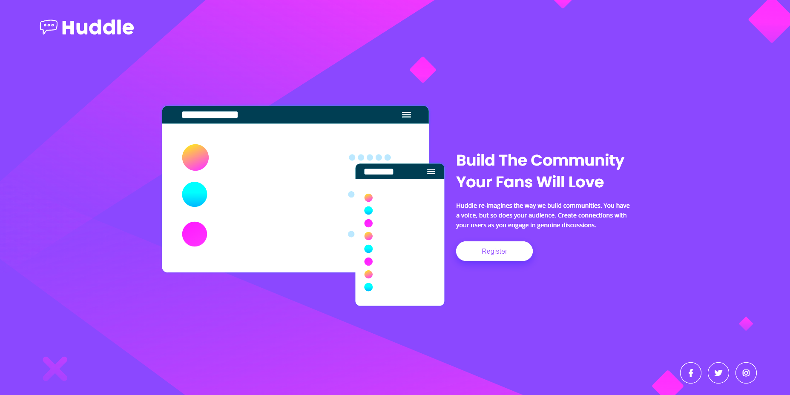

# Frontend Mentor - Solucao da landing page Huddle com uma unica secao introdutoria

Esta e a minha solucao para o desafio [Huddle landing page with single introductory section no Frontend Mentor](https://www.frontendmentor.io/challenges/huddle-landing-page-with-a-single-introductory-section-B_2Wvxgi0). Este projeto foi uma boa oportunidade para praticar estruturacao de layout, responsividade e estados de hover usando HTML e CSS.

## Sumario

- [Frontend Mentor - Solucao da landing page Huddle com uma unica secao introdutoria](#frontend-mentor---solucao-da-landing-page-huddle-com-uma-unica-secao-introdutoria)
  - [Sumario](#sumario)
  - [Visao geral](#visao-geral)
  - [O desafio](#o-desafio)
  - [Screenshot](#screenshot)
  - [Links](#links)
  - [Meu processo](#meu-processo)
  - [Tecnologias utilizadas](#tecnologias-utilizadas)
  - [O que aprendi](#o-que-aprendi)
  - [Desenvolvimento continuo](#desenvolvimento-continuo)
  - [Recursos uteis](#recursos-uteis)
  - [Colaboracao com IA](#colaboracao-com-ia)
  - [Autor](#autor)
  - [Agradecimentos](#agradecimentos)

## Visao geral

Projeto de landing page estatica inspirado no desafio do Frontend Mentor, com foco em uma apresentacao inicial simples, layout responsivo e elementos interativos como botao e icones sociais com efeito de hover.

## O desafio

Os usuarios devem ser capazes de:

- Visualizar o layout ideal da pagina de acordo com o tamanho da tela do dispositivo
- Ver os estados de hover em todos os elementos interativos

## Screenshot




Se voce ainda nao adicionou a imagem final do projeto, substitua este caminho depois de exportar um screenshot da interface pronta.

## Links

- URL da solucao: [Repositório](https://github.com/wellfefe/First-landing-page)
- URL do site ao vivo: [Site ao vivo](https://wellfefe.github.io/First-landing-page/)

## Meu processo

Este projeto foi construido com uma estrutura simples e organizada:

- `index.html` para a marcacao principal da pagina
- `src/css/reset.css` para normalizacao basica
- `src/css/variables.css` para variaveis de cores e fontes
- `src/css/style.css` para os estilos principais
- `src/css/responsive.css` para os ajustes responsivos
- `src/images` para os arquivos visuais do projeto

## Tecnologias utilizadas

- HTML5 semantico
- CSS custom properties
- CSS Grid
- Flexbox
- Media queries para responsividade
- Google Fonts
- Font Awesome

## O que aprendi

Durante o desenvolvimento, pratiquei a combinacao de CSS Grid com Flexbox para organizar a estrutura principal da pagina e alinhar os elementos internos com mais controle. Tambem reforcei o uso de media queries para adaptar o layout em telas menores, especialmente na troca do fundo, no redimensionamento do mockup e no reposicionamento do conteudo.

Um detalhe interessante foi ajustar a largura e o comportamento do texto em resolucoes menores sem precisar alterar a estrutura HTML. Um exemplo disso foi:

```css
@media (max-width: 965px) {
  .description {
    max-width: 95%;
    font-size: 1.6rem;
  }
}
```

Esse tipo de ajuste ajuda bastante a melhorar a leitura no mobile e a deixar a quebra de linha mais natural.

## Desenvolvimento continuo

Nos proximos projetos, quero continuar evoluindo em:

- Planejamento de responsividade desde o inicio
- Melhor definicao de breakpoints para diferentes tamanhos de tela
- Refinamento de espacamento, proporcao visual e fluxo de texto no mobile

## Recursos uteis

- [Frontend Mentor](https://www.frontendmentor.io/) - Plataforma que fornece desafios praticos para treinar HTML e CSS com interfaces reais.
- [MDN Web Docs](https://developer.mozilla.org/pt-BR/) - Referencia excelente para consultar propriedades CSS, comportamento responsivo e boas praticas de layout.

## Colaboracao com IA

Usei IA como apoio durante o projeto para revisar decisoes de responsividade, comparar abordagens de layout e melhorar a clareza da documentacao. Ela foi especialmente util para:

- Revisar ideias para media queries
- Entender diferentes formas de controlar a quebra de texto no mobile
- Melhorar a escrita e a estrutura do README

O mais importante foi usar essas sugestoes como apoio e sempre validar tudo no layout real antes de considerar a implementacao final.

## Autor

- GitHub - [@wellfefe](https://github.com/wellfefe)

- Frontend Mentor - [@wellfefe](https://www.frontendmentor.io/profile/wellfefe)

## Agradecimentos

Meus agradecimentos ao Frontend Mentor por disponibilizar desafios praticos que ajudam bastante no treino de HTML, CSS e construcao de interfaces responsivas.
